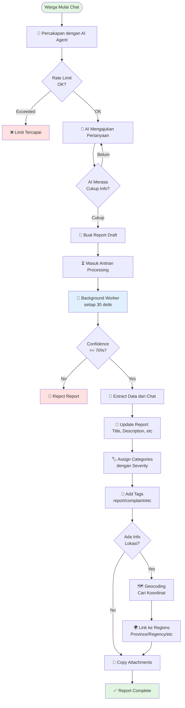

# Citizen Report Flow

> **Untuk Kontributor**: Dokumentasi ini menjelaskan bagaimana sistem laporan warga bekerja dari awal sampai akhir.

## 🎯 Apa yang Dilakukan Sistem Ini?

Sistem ini memungkinkan warga melaporkan masalah di lingkungan mereka melalui **percakapan dengan AI agent**. Warga tidak perlu mengisi form yang panjang - cukup ceritakan masalahnya secara natural, dan AI akan membantu mengekstrak informasi penting.

**Contoh interaksi**:
```
Warga: "Ada jalan rusak di depan rumah saya"
Agent: "Bisa tolong ceritakan lebih detail? Di mana lokasinya?"
Warga: "Di Jalan Sudirman, Kecamatan Cibiru, Bandung. Sudah 2 minggu..."
Agent: "Berapa besar lubangnya? Apakah berbahaya?"
Warga: "Lumayan besar, banyak motor yang jatuh"
Agent: [Submit report dengan kategori Infrastructure, severity High]
```

## 📊 Flow Diagram



## 🔄 Alur Lengkap (2 Fase)

### Fase 1: Chat dengan AI Agent

**File**: `src/features/citizen_report_agent/handlers/chat_handler.rs`

1. **Warga kirim pesan** via API `/api/citizen-report-agent/chat`
   - Bisa buat thread baru atau lanjutin conversation yang udah ada
   - Support streaming (SSE) untuk real-time response

2. **Rate Limit Check**
   - Cek apakah warga sudah exceed limit harian (default: 3 laporan/hari)
   - Kalau exceed, return error 429

3. **AI Agent Berinteraksi**
   - Agent punya system prompt yang ngajarin cara bertanya
   - Agent bisa panggil tools (salah satunya: `submit_report`)
   - Conversation disimpan di database (ADK tables)

4. **Agent Decide: Submit atau Tanya Lagi?**
   - Kalau info masih kurang jelas, agent tanya lagi
   - Kalau udah cukup, agent panggil tool `submit_report`

5. **Submit Report**
   - Buat record di tabel `reports` dengan status `submitted`
   - Buat job di tabel `report_jobs` dengan status `pending`
   - Kasih reference number ke warga (misal: `REF-20250206-001`)

---

### Fase 2: Background Processing

**File**: `src/features/reports/workers/report_processor.rs`

Background worker jalan setiap **30 detik**, ambil maksimal **10 jobs** yang pending.

#### Step 1: Check Confidence Score

```rust
if confidence < 0.7 {
    // Reject report - AI gak yakin info-nya cukup
    reject_report()
}
```

**Kenapa?** Filter laporan yang quality-nya rendah atau info-nya kurang lengkap.

#### Step 2: Extract Structured Data

**File**: `src/features/reports/services/extraction_service.rs`

Worker panggil LLM untuk baca conversation dan extract:

- **Title**: Judul singkat laporan
- **Description**: Deskripsi lengkap masalah
- **Categories**: Kategori masalah (bisa lebih dari 1!)
  - Infrastructure, Environment, Public Safety, Social Welfare, Other
  - Masing-masing kategori punya severity: Low/Medium/High/Critical
- **Tag Type**: Jenis laporan
  - `report`: Observasi biasa
  - `complaint`: Keluhan/komplain
  - `proposal`: Usulan perbaikan
  - `inquiry`: Pertanyaan
  - `appreciation`: Apresiasi
- **Timeline**: Kapan kejadiannya
- **Impact**: Siapa yang terdampak
- **Location**: Informasi lokasi (village, district, regency, province)

**Contoh Output LLM**:
```json
{
  "title": "Jalan Berlubang di Jl. Sudirman",
  "description": "Ada lubang besar di tengah jalan...",
  "categories": [
    {"slug": "infrastructure", "severity": "high"},
    {"slug": "public-safety", "severity": "critical"}
  ],
  "tag_type": "complaint",
  "timeline": "Sudah 2 minggu",
  "impact": "Banyak pengendara motor jatuh",
  "location_regency": "Bandung",
  "location_district": "Cibiru",
  "location_province": "Jawa Barat"
}
```

#### Step 3: Update Report

Worker update database dengan data yang sudah di-extract:
- Update `reports` table
- Insert ke `report_categories` (multi-category dengan severity)
- Insert ke `report_tags`

#### Step 4: Geocoding (Cari Koordinat)

**Kalau ada info lokasi**, worker coba geocode untuk dapetin koordinat GPS.

**Strategi Cascading** (coba dari yang paling spesifik):

```
1. Coba: Village + District + Regency + Province
   ↓ Gagal?
2. Coba: District + Regency + Province
   ↓ Gagal?
3. Coba: Regency + Province
```

**Kenapa cascading?** Data OpenStreetMap Indonesia tidak konsisten:
- Daerah Jawa: Data lengkap sampai desa
- Daerah Sumatra/Kalimantan: Sering cuma ada kabupaten

**Catatan**: Street name (Jl. Sudirman, dll) disimpan tapi **TIDAK** dipakai untuk geocoding karena data OSM Indonesia untuk nama jalan sangat tidak lengkap.

#### Step 5: Region Lookup

Setelah dapat koordinat, link ke region hierarchy (province → regency → district → village).

**Penting**: FK region yang disimpan sesuai dengan level geocoding:
- **Village level**: Simpan semua FK (province_id, regency_id, district_id, village_id)
- **District level**: Simpan province_id, regency_id, district_id (no village_id)
- **Regency level**: Simpan province_id, regency_id (no district/village)

Kenapa? Supaya kita tau seberapa akurat lokasi yang kita dapet.

#### Step 6: Copy Attachments

Kalau warga upload foto/file saat chat, link file-file tersebut ke report.

#### Step 7: Done!

Mark job sebagai `completed`. Report siap untuk direview admin/pemerintah.

---

## 🗂️ Database Tables

**`reports`** - Report utama
- `id`, `user_id`, `reference_number`
- `title`, `description`, `timeline`, `impact`
- `status`: submitted → processing → completed/rejected
- `adk_thread_id`: Link ke conversation

**`report_jobs`** - Queue untuk background processing
- `report_id`, `status`, `confidence_score`
- `retry_count`: Kalau gagal, coba lagi (max 3x)

**`report_categories`** - Multi-category support
- `report_id`, `category_id`, `severity`
- Satu report bisa punya banyak kategori

**`report_tags`** - Jenis laporan
- `report_id`, `tag_type` (report/complaint/proposal/etc)

**`report_locations`** - Lokasi dengan koordinat
- `report_id`, `latitude`, `longitude`
- `province_id`, `regency_id`, `district_id`, `village_id`

**ADK Tables** (dikelola library `balungpisah_adk`)
- `threads`, `messages`, `episodes` - Conversation history
- `thread_attachments` - File uploads

---

## 🛠️ Kalau Mau Kontribusi

### Improvement Ideas

**Mudah (Good First Issue)**:
- [ ] Tambah unit test untuk extraction service
- [ ] Improve system prompt untuk kategori tertentu
- [ ] Dokumentasi API endpoints

**Medium**:
- [ ] Webhook notification saat report selesai diproses
- [ ] Admin dashboard untuk monitoring queue
- [ ] Export report ke CSV/Excel

**Advanced**:
- [ ] Duplikasi detection (report serupa di lokasi yang sama)
- [ ] ML classifier untuk kategori (kurangi biaya LLM)
- [ ] Report clustering berdasarkan geographic proximity

### Files yang Relevan

```
src/features/citizen_report_agent/
  ├── handlers/chat_handler.rs          # API endpoint chat
  ├── services/agent_runtime_service.rs # Agent logic
  └── dtos/                             # Request/response types

src/features/reports/
  ├── workers/report_processor.rs       # Background worker
  ├── services/
  │   ├── extraction_service.rs         # LLM extraction
  │   ├── geocoding_service.rs          # Geocoding logic
  │   └── region_lookup_service.rs      # Region FK resolution
  └── models/                           # Database models

src/shared/prompts/                     # System prompts untuk AI
```

---

## 💡 Design Decisions

### Kenapa Pakai AI Agent untuk Chat?

**Alternatif**: Form dengan field-field fixed

**Keuntungan AI Agent**:
- ✅ Natural conversation - warga tidak perlu paham istilah teknis
- ✅ Flexible - bisa handle berbagai jenis laporan
- ✅ Better UX - tidak intimidating untuk non-tech users
- ✅ Context-aware - AI bisa tanya follow-up yang relevan

**Trade-off**:
- ⚠️ Cost: LLM API calls
- ⚠️ Unpredictable: AI bisa ngomong hal yang gak diharapkan
- ⚠️ Latency: Response agak lambat dibanding form biasa

### Kenapa Pakai Background Worker?

**Alternatif**: Process langsung pas report di-submit

**Keuntungan Background Worker**:
- ✅ Fast response ke user - gak perlu nunggu processing selesai
- ✅ Retry mechanism - kalau geocoding fail, bisa retry
- ✅ Rate limiting - prevent overwhelm geocoding API
- ✅ Better error handling - failed job gak bikin user request error

### Kenapa Multi-Category dengan Severity?

**Alternatif**: Single category per report

**Keuntungan Multi-Category**:
- ✅ Real-world accuracy - banyak masalah yang overlap kategori
  - Contoh: Banjir → Environment (sampah nyumbat) + Infrastructure (drainase rusak) + Public Safety (berbahaya)
- ✅ Better analytics - tracking cross-category trends
- ✅ Flexible severity - satu kategori bisa lebih urgent dari yang lain

---

Punya pertanyaan atau mau diskusi? Buka issue di GitHub! 🚀
